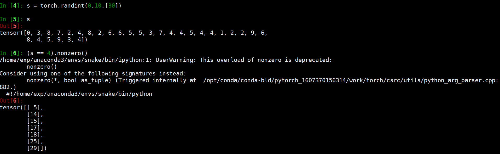

# 不熟练的语法总结归纳1

主要是总结一些在阅读的代码中经常看见、比较有用，但是自己平时又不怎么使用的代码技巧以及用法。

## 1 nonzero（）返回值的类型以及shape



这里的s是1个长度为100的1维数组，我们的目的是找出这个1维数组中具有相应值的数组元素下标。比如说，在这个例子里就是找到s中元素值为4的所有元素下标。注意：这里返回的是一个2维数组，而不是1维的；如果需要变成1维的，可以直接使用.view(-1)进行转换。


## 2 Tensor的索引必须使用Long类型

## 3 Tensor进行维度拼接的时候含有值为空的Tensor数组


从上述代码可知，由多个空1维张量组成的2维张量会自动转换为一个空的1维列表，其是不能参与这里的维度直接拼接的，必须要把它转化成（0，4）的shape。转化之后拼接就不会报错，但是拼接的结果中不会含有这些空的值。


### 4  3维数组的2维索引方式

如下图所示，可以发现[...,1:2]这种索引方式中的1：2是只针对3维矩阵的最后1维进行的，而不是很容易想得到的第1维上。


从下图可以看出，...方法可以很自然地推断出维度的数目，比如下图中的上面1例就是后两个维度，但是下面1例就只是中间1个维度而已。


#### 5  使用None进行索引的结果会自动增加1个维度，增加在第0维度的位置上


#### 6 各种torch运算

```
torch.roll

torch.argsort

torch.expand

torch.round

torch.clamp

torch.cumsum

torch.all

torch.meshgrid

torch.nn.functional.grid_sample

 tf.add_to_collection

np.prod

tf.scatter_nd

tf.multiply

tf.nn.elu

shape.as_list()

tf.truncated_normal_initializer

tf.layers.conv1d

tf.layers.max_pooling1d


tf.layers.average_pooling2d

tf.nn.max_pool_with_argmax

tf.nn.top_k

 tf.batch_gather

tf.reduce_min

tf.cond

tf.less

tf.train.SessionManager

sm.prepare_session

tf.tile

tf.one_hot

tf.control_dependencies
```


